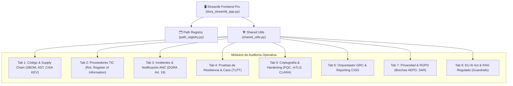

# 🛡️ Informe Ejecutivo CISO / CTO
**Plataforma Empresarial de Cumplimiento Multi-Normativa, Resiliencia y Gobernanza IA**  
*Quantigrade Compliance & Security Suite v2.0*

---

## Executive Summary

La plataforma **Quantigrade** se ha consolidado como un centro de control unificado y orquestador técnico para la auditoría continua, la gestión de riesgos TIC, la resiliencia operativa y la gobernanza de Inteligencia Artificial. Diseñada bajo un paradigma **Zero Trust (HITL - Human In The Loop)**, la suite permite a las organizaciones financieras, infraestructuras críticas y entidades esenciales cumplir simultáneamente con los marcos regulatorios de la Unión Europea y estándares internacionales.

> [!IMPORTANT]
> **Estado de la Plataforma**: 🟢 **OPERATIVO EN PRODUCCIÓN**  
> **Ubicación de Despliegue**: `E:\PROYECTOS IA\AUDITORIAS\COMPILANCE_PLATFORM`  
> **Verificación Técnica**: 16/16 módulos compilados sin errores | Auditado con `Ruff`, `Mypy` y `Bandit`.

---

## 🏛️ Cobertura Multi-Normativa Integrada

La arquitectura proporciona soporte automatizado de punta a punta para **7 marcos regulatorios y técnicos clave**:

| Normativa / Marco | Ámbito Regulatorio | Componentes & Controles Operativos |
| :--- | :--- | :--- |
| **DORA** *(Reg. UE 2022/2554)* | Resiliencia Operativa Digital Financiera | Clasificación de incidentes RTS EBA, gestión de riesgo de terceros TIC, pruebas TLPT y respaldos inmutables. |
| **ENS Alta** *(RD 311/2022)* | Esquema Nacional de Seguridad | Hardening automatizado con suite CLARA (`CLARAfix_ALTO.ps1`), auditorías de control de acceso (op.acc.1) y gestión de parches (op.exp.4). |
| **NIS2** *(Dir. UE 2022/2555)* | Ciberseguridad de Entidades Críticas | Notificación a CSIRTs nacionales en 24h/72h, agregación de advisories VEX en cadena de suministro. |
| **RGPD / LOPDGDD** | Privacidad y Protección de Datos | Gestión de brechas AEPD en 72h, ejercicio de derechos ARCO (SAR), purgado seguro de datos y pseudonimización PowerShell. |
| **CRA** *(Cyber Resilience Act)* | Seguridad de Productos con Elementos Digitales | Evaluación de conformidad de software, generación de SBOM CycloneDX 1.6 y trazabilidad SLSA Level 3+. |
| **Ley de IA de la UE** | Gobernanza de Modelos de IA | Matriz de evaluación de riesgos para sistemas de IA de alto riesgo, supervisión humana y auditoría de datasets. |
| **OWASP LLM Top 10** | Seguridad en Inteligencia Artificial Generativa | Guardrails RAG interactivo, mitigación de Prompt Injection, Poisoning y fugas de datos sensibles (PII). |

---

## 📐 Arquitectura Técnica & Endurecimiento

### Pilares Tecnológicos de Seguridad (CTO Perspective)

1. **Criptografía Post-Cuántica (PQC)**:
   - Integración de algoritmos estándar FIPS 204 (**ML-DSA**) para la firma digital inmutable de commits Git.
   - Verificador de canales **TLS Híbridos (ML-KEM + ML-DSA)** y evaluación de agilidad criptográfica ante migración post-RSA.

2. **Inmutabilidad y Trazabilidad de Logs**:
   - Algoritmo de integridad basado en **Merkle Trees (SHA-256)** para la detección de manipulaciones en registros de auditoría (`20_verify_log_immutability.py`).

3. **Zero Trust & mTLS**:
   - Generador automático de certificados **mTLS Zero Trust (ECDSA P-384)** para comunicación cifrada punto a punto entre microservicios.

4. **Hardening Nivel SO & Kernel**:
   - Scripts de aplicación de políticas de seguridad automatizados mediante PowerShell (**CLARAfix_ALTO.ps1** para ENS Nivel Alto y **DISA STIG**).

---

## 🚨 Gestión de Incidentes y Reporting ANC

La plataforma cuenta con un ciclo de vida completo para la gestión de ciberincidentes y reporte normativo:

- **Clasificación RTS EBA / DORA Art. 18**: Calculadora en tiempo real de criterios de severidad (clientes afectados, horas de indisponibilidad, pérdida económica y alcance transfronterizo).
- **Notificación Automática ANC / EBA**:
  - ⏱️ **Alerta Inicial (2 horas)**
  - ⏱️ **Informe Intermedio (24 horas)**
  - ⏱️ **Informe Final y Plan de Remediación (1 mes)**
- **RCA Post-Mortem (ISO 27035)**: Generador de Análisis de Causa Raíz para comités de crisis.

---

## 📊 Auditoría de Calidad y Seguridad del Código (Code Doctor)

Se ha sometido la totalidad de la codebase de la plataforma a una auditoría estricta de desarrollo:

- **Sintaxis y Compilación**: `py_compile` ejecutado en los 16 módulos Python con **0 errores**.
- **Linter de Código**: `ruff check` superado sin advertencias.
- **Tipado Estricto**: `mypy` ejecutado con éxito en los componentes críticos de infraestructura.
- **Auditoría SAST de Seguridad (Bandit)**: 0 vulnerabilidades severas o medias. Se identificaron 4 llamadas a `subprocess` clasificadas como *Low Severity*, inherentes al diseño del orquestador de herramientas CLI del sistema.

---

## 📈 Conclusiones y Recomendaciones para la Dirección

> [!TIP]
> **Recomendación CISO**: Desplegar la suite en el entorno de staging de auditoría e iniciar las simulaciones de pruebas de caos (Tab 4) para validar los RTO/RPO antes de la fecha límite de cumplimiento DORA.

> [!TIP]
> **Recomendación CTO**: Integrar el ejecutable `05_cisa_kev_gate.py` dentro del pipeline CI/CD corporativo para bloquear automáticamente cualquier build que incorpore dependencias vulnerables registradas en el catálogo KEV de CISA.

---
*Informe generado automáticamente por Quantigrade Compliance Suite.*  
*Fecha de Emisión: 2026-09-02*
